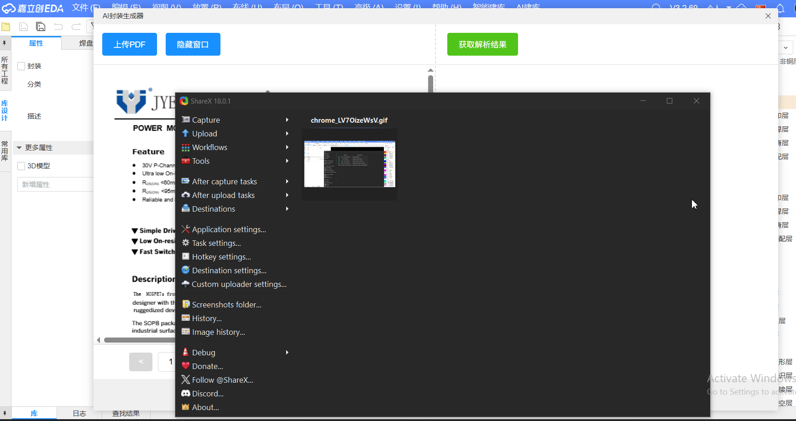

# AI Intelligent Library Builder

An AI-powered package generator based on a self-developed large language model, providing an intelligent component library construction solution for JLC EDA Professional Edition.

## Features

- **AI-Driven**: Uses a proprietary large model to intelligently recognize and generate packages
- **PDF Parsing**: Extracts component information directly from PDF datasheets
- **High Accuracy**: Automatically identifies pin information, package parameters, and component specifications
- **Multi-Package Support**: Supports various package types such as BGA, SOIC, QFN, and more
- **Visual Interface**: Offers an intuitive graphical user interface
- **Real-Time Preview**: Enables real-time preview of generated packages

## Core Functions

### Package Generation

- **Parameter Extraction**: Extracts package dimension parameters from technical documents
- **Automatic Generation**: Automatically generates packages based on extracted parameters
- **Preview Function**: Provides real-time package preview
- **Parameter Adjustment**: Supports manual fine-tuning of package parameters

## Supported Package Types

| Package Type | Support Status | Description                                                      |
| ------------ | -------------- | ---------------------------------------------------------------- |
| **BGA**      | ✅ Supported   | Ball Grid Array package; inner rectangle pending API enhancement |
| **QFN**      | ✅ Supported   | Quad Flat No-Lead package                                        |
| **SOP**      | ✅ Supported   | Small Outline Package                                            |

## Usage Guide

### Creating a Package

1. In the EDA editor, select File → New → Package.
2. From the top navigation bar of the symbol editor, choose AI Library Builder → Create.
3. In the AI Package Generator, upload the PDF from which the package information will be extracted.
4. Click Get Parsing Results. All detected package results will be listed. If nothing appears, wait a few seconds and try again.
5. Select the desired result and click Create Package to generate the corresponding package.
